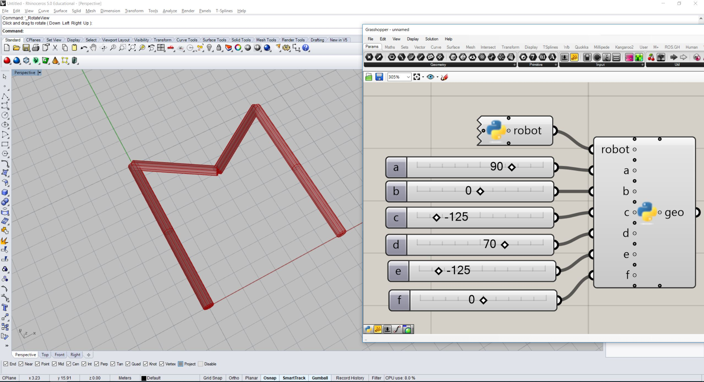

# Assignments

## Module 2: Session 1

### Project box to xy-plane

1. Create a box and transform it to a certain location.
1. Create a `Projection` (can be orthogonal, parallel or perspective) and project the box' vertices onto the xy-plane.
1. Draw the edges of the projected box corners with an `Artist` of your preference. (tip: `Mesh` will help you there...)

 

### Build your own robot model

1. Build your own robot with a certain number n of links and n - 1 joints. 
1. Create a `Configuration` with certain values and the correct joint types.
1. Create a `RobotArtist` of your preferance (e.g. `compas_fab.ghpython` or `compas_fab.rhino`)
1. Use the artist to `update` the robot with the created configuration, such that it configures into the letter of your choice (or any other identifiable figure).

 

