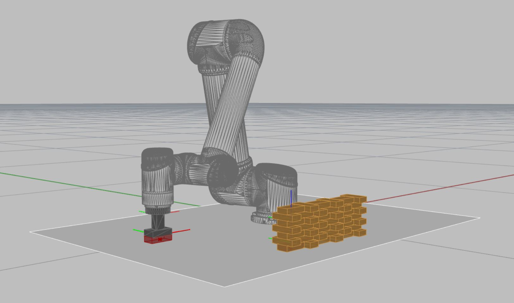

# Assignments

## Module 2: Session 2

1. Create a brick assembly with a single flemish bond and save into `flemish_bond.py` (check example nr. 27). Serialise your assembly into `00_flemish_bond.json`. 
1. In GhPython load the assembly from the saved json file and visualise it to check if all bricks are where they should be (use ghx file example nr. 20). 
1. Now transform the assembly a location where it is a) still within robot reach and b) not too close to the robot to avoid collisions.
1. After transformation save the assembly into `01_flemish_bond_transformed.json`
1. Create a new file `flemish_bond_planning.py` in which you create the assembly from `01_flemish_bond_transformed.json`.
1. Here create a planning scene, add floor, define/load picking_frame, etc. from settings (check example nr. 26.).
1. Iterate over all brick in the assembly and for each brick calculate pick and place paths and append brick to planning scene.
1. Save all paths in the element
1. Serialise assembly into `02_flemish_bond_planned.json`

 
